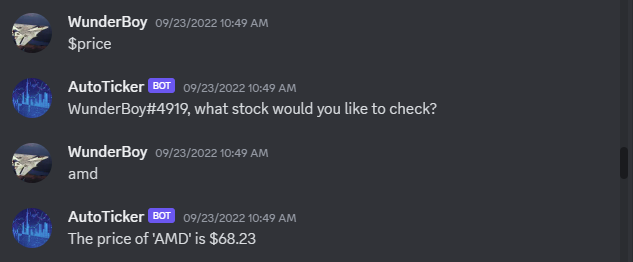
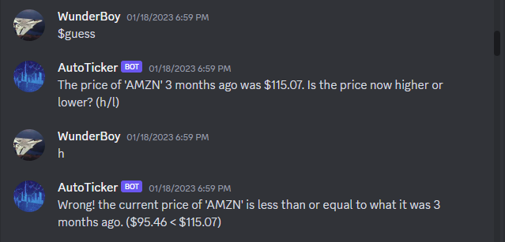

# AutoTicker Bot

Hi, welcome to my Discord bot!

Autoticker is a bot to help you with everyday trading by allowing you to see the current, opening, and previous closing price of equities that are listed on Yahoo! Finance using yfinance, a library that collects real-time market data and sends it back to the Discord client. In addition, you can also set stock price alerts where once your equity reaches the desired price you'll be given an @ notification on Discord. Also feel free to pass some time by enjoying the stock price guessing game included in the bot as well.

<h1></h1>

 Here is a showcase of some of the basic commands, such as $price to check the current price and $open to check the opening price of an equity for the day. 

  
  
  

   

 the $higher or $lower command will allow you to set a price alert on a stock for when it goes up or down in price respectively. 

  

   

 The $guess command will select a random ticker and retrieve its closing price from 3 months earlier and ask you to guess whether or not its current price is higher or lower than the historical price. 

  

